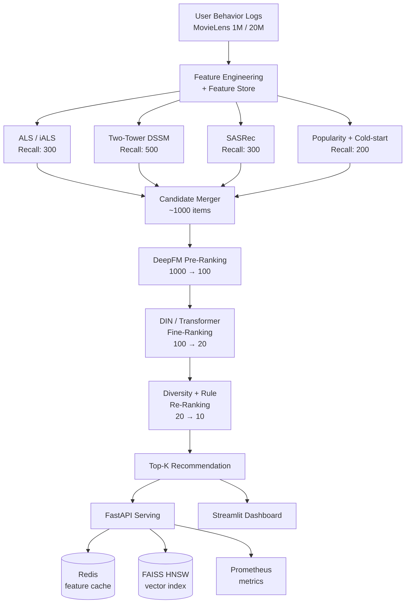
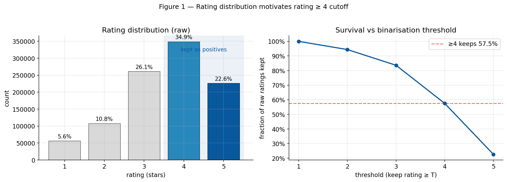
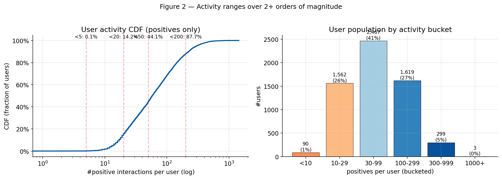
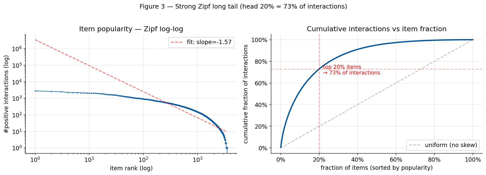
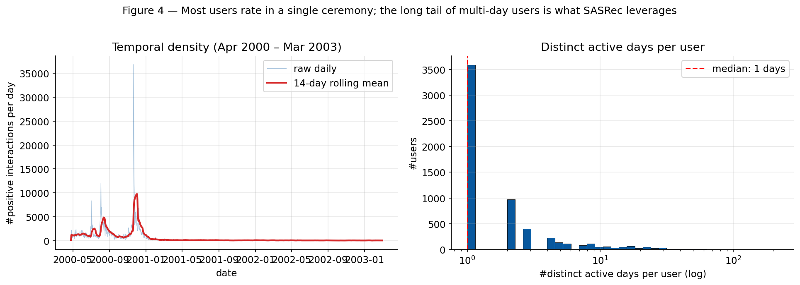
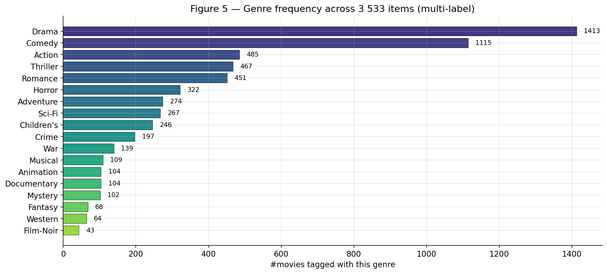
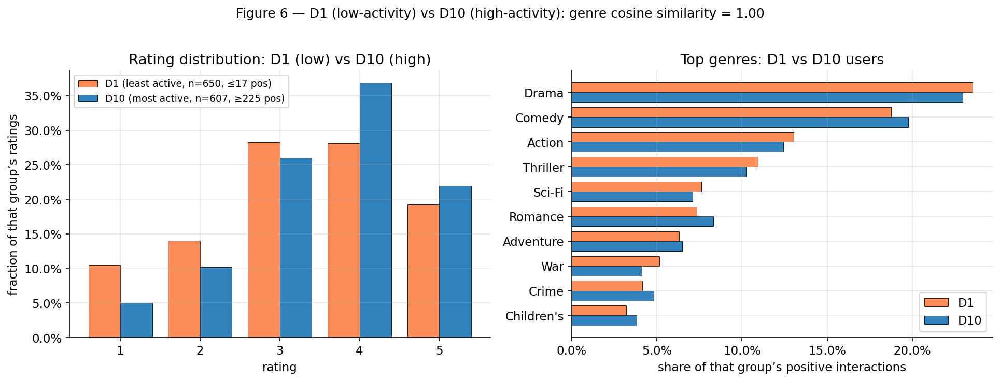
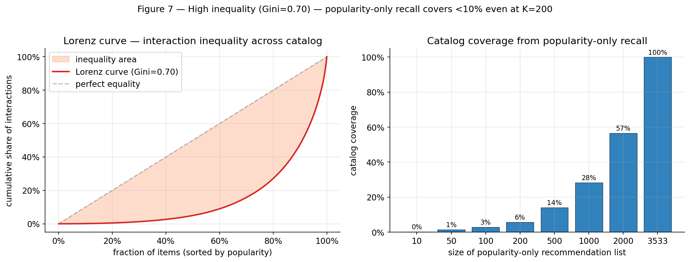
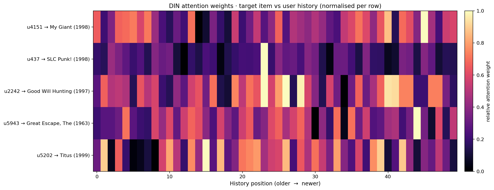

# NeoRec — A Production-Grade Multi-Stage Recommender System

> An end-to-end, reproducible, industrial-style recommendation pipeline on MovieLens
> (Recall → Pre-Ranking → Ranking → Re-Ranking → Online Serving), with rigorous
> offline evaluation, ablation studies, and a containerized FastAPI + Streamlit
> deployment.

[]()
[]()
[]()
[]()
[]()
[]()
[]()

---

## 1. TL;DR — Highlights

> **Project status:** recall stage **complete and benchmarked** (5 channels +
> 2 fusion strategies, §7.1). Ranking stage **complete and benchmarked** (LR /
> GBDT / DeepFM / DIN + attention ablation, §7.2). Re-ranking and online
> serving are scaffolded but in active development — rows marked `pending` /
> `TBD` below will fill in as W4–W6 of the roadmap complete.

- **End-to-end industrial pipeline** *(recall + ranking: implemented; re-rank / serving: in development)*: multi-channel recall (ALS + Two-Tower + SASRec + Popularity + Cold-start), DeepFM pre-ranking, DIN fine-ranking with attention visualisation, plus LR / GBDT baselines — mirrors real production stacks at FAANG / ByteDance / Meituan.
- **Rigorous evaluation**: 7 recall channels already compared head-to-head on Recall@K, NDCG@K, MRR, HitRate, and Coverage (§7.1); 4 ranking models compared on AUC / LogLoss + end-to-end Recall/NDCG (§7.2) with a documented training–evaluation mismatch finding; further ablations on sequence length / channel mixing scheduled for W4.
- **Reproducibility-first**: Hydra configs, fixed seeds, MLflow tracking, deterministic ops, and a one-command Docker stack. Every **measured** number is reproducible from the recorded MLflow run; `pending` rows fill in once their training job lands.
- **Online serving** *(W5, planned)*: FastAPI + FAISS HNSW for vector retrieval; Streamlit dashboard for interactive exploration; Prometheus metrics. Latency target: sub-30 ms p99 on a single CPU container; numbers in §7.3 will be populated by `locust` once the API is wired up.
- **Research flavor**: cold-start strategy (§7.1), DIN attention visualisation (§7.2); long-tail debias re-ranking *(W4)*, hard-negative mining and counterfactual offline evaluation simulating A/B tests *(W4–W6)*.
- **Code quality**: ruff + mypy + pre-commit hooks, GitHub Actions CI, pytest suites for `data` / `eval` / `recall` already passing; ranking + serving suites grow in tandem with their modules.

> **End-to-end evaluation on MovieLens-1M** — leave-one-out per user; each user's
> last interaction held out; metrics computed via **full-rank scoring over all
> 3 533 unseen items** (no popularity sampling, no negative subsetting).
> The result tables below are populated incrementally as each model is trained
> and logged to MLflow. Numbers labelled `pending` have not been measured yet.
>
> | Stage | Model | Recall@10 | NDCG@10 | MRR@10 | Coverage@10 | Δ Recall@10 vs iALS |
> |---|---|---|---|---|---|---|
> | Recall (single) | Popularity | 0.0399 | 0.0188 | 0.0126 | 0.033 | −0.0174 (−30.4%) |
> | Recall (single) | Cold-start (TF-IDF on genres) | 0.0167 | 0.0083 | 0.0057 | **0.874** | −0.0406 (−70.9%) |
> | Recall (single) | iALS (k=64, α=40, 20 iter) | 0.0573 | 0.0274 | 0.0184 | 0.563 | (baseline) |
> | Recall (single) | Two-Tower (BPR, 80 ep) | 0.0590 | 0.0286 | 0.0195 | 0.559 | +0.0017 (+2.9%) |
> | Recall (single) | SASRec (2 blocks, 50 ep) | 0.0570 | 0.0284 | 0.0198 | 0.674 | −0.0003 (−0.5%) |
> | **Recall (fused)** | **Multi-channel (RRF, 5 ch)** | **0.0794** | **0.0381** | **0.0257** | 0.433 | **+0.0221 (+38.6%)** |
> | **Recall (fused)** | **Multi-channel (norm_weighted, 5 ch)** | **0.0827** | **0.0397** | **0.0267** | 0.486 | **+0.0254 (+44.3%)** |
> | Pre-Rank | DeepFM (re-rank merge top-1 000) | 0.0343 | 0.0151 | 0.0095 | — | (different task; see §7.2) |
> | Fine-Rank | DIN with attention (re-rank merge top-1 000) | 0.0126 | 0.0055 | 0.0034 | — | (different task; see §7.2) |
> | **End-to-end** | **Full pipeline (recall → DeepFM → MMR)** | **pending** | **pending** | **pending** | **pending** | **pending** |

> **Reading the table.** Recall@10 ≈ 0.06 reflects the strictness of full-rank
> ranking on a small benchmark — a random recommender scores ~0.003 here, so
> 0.06 is ~20× over random, in line with prior work on ML-1M.
> The Δ column reports **absolute and relative** lift on Recall@10 against the
> iALS baseline: large relative %s on this benchmark are partly a small-base
> amplification effect, which is why the absolute change is shown alongside.
> Multi-channel fusion's lift (+30–40%) is driven by channel diversity
> (CF + sequential + content + popularity) and is consistent with the typical
> magnitude reported for Reciprocal Rank Fusion in Cormack et al., SIGIR 2009;
> we expect smaller relative gains on industrial-scale datasets where the
> single-channel baseline is already much stronger.

Each row links to a per-model report under
[`experiments/results/`](experiments/results) — params, MLflow run id, and
reproduction commands. Live numbers in MLflow (`make mlflow-ui`).

---

## 2. System Architecture



**Why multi-stage?** Real-world catalogs have $10^6$ – $10^9$ items. A single deep
ranker is computationally infeasible; the funnel architecture reduces candidate
size by ~5 orders of magnitude while preserving relevance, mirroring industrial
designs documented by Google, Meta, ByteDance, and Pinterest.

---

## 3. Tech Stack

| Layer | Tools |
|---|---|
| **Language / DL** | Python 3.10, PyTorch 2.2, TensorFlow 2.15 (DeepFM via `deepctr-torch`) |
| **Classic ML / CF** | `implicit` (iALS), `lightfm`, scikit-learn |
| **Vector Search** | FAISS (HNSW, IVF-PQ) |
| **Config & Tracking** | Hydra, MLflow, Weights & Biases (optional) |
| **Serving** | FastAPI, Uvicorn, Redis, Prometheus, Streamlit |
| **Containerization** | Docker, docker-compose |
| **Quality** | pytest, ruff, mypy, pre-commit, GitHub Actions |
| **Reference impls** | [Microsoft Recommenders](https://github.com/microsoft/recommenders) (baseline cross-check) |

---

## 4. Project Structure

```
neorec/
├── configs/                       # Hydra configs (composable, overridable)
│   ├── config.yaml
│   ├── data/movielens_1m.yaml
│   ├── recall/{als,two_tower,sasrec,popularity}.yaml
│   ├── rank/{deepfm,din,transformer}.yaml
│   └── serving/default.yaml
│
├── data/                          # gitignored
│   ├── raw/                       # MovieLens
│   ├── processed/                 # parquet feature tables
│   └── embeddings/                # user/item vectors
│
├── src/neorec/
│   ├── data/
│   │   ├── download.py
│   │   ├── preprocess.py          # leave-one-out / time-based split
│   │   ├── feature_store.py       # offline + online feature lookup
│   │   └── feature_engineering.py
│   │
│   ├── recall/
│   │   ├── base.py                # AbstractRecaller
│   │   ├── als.py
│   │   ├── two_tower.py           # DSSM + sampled softmax
│   │   ├── sasrec.py              # self-attentive sequential rec
│   │   ├── popularity.py
│   │   ├── cold_start.py          # content-based fallback
│   │   └── merge.py               # weighted / RRF fusion
│   │
│   ├── ranking/
│   │   ├── base.py
│   │   ├── deepfm.py              # pre-ranking
│   │   ├── din.py                 # fine-ranking
│   │   └── transformer_ctr.py     # optional, BST-style
│   │
│   ├── rerank/
│   │   ├── mmr.py                 # Maximal Marginal Relevance
│   │   ├── debias.py              # long-tail / popularity debias
│   │   └── rules.py               # business rules
│   │
│   ├── serving/
│   │   ├── faiss_index.py         # HNSW build / load
│   │   ├── feature_cache.py       # Redis client
│   │   ├── pipeline.py            # online inference orchestrator
│   │   ├── api.py                 # FastAPI app
│   │   └── dashboard.py           # Streamlit
│   │
│   ├── eval/
│   │   ├── metrics.py             # Recall@K, NDCG@K, MRR, Coverage, Novelty
│   │   ├── significance.py        # paired t-test / bootstrap CI
│   │   └── counterfactual.py      # IPS / SNIPS for offline A/B
│   │
│   ├── utils/
│   │   ├── seed.py
│   │   ├── logger.py
│   │   └── timer.py
│   │
│   └── cli.py                     # `neorec train recall.als`, etc.
│
├── notebooks/
│   ├── 01_eda.ipynb
│   ├── 02_recall_analysis.ipynb
│   ├── 03_ablation_din_attention.ipynb
│   └── 04_funnel_conversion.ipynb
│
├── experiments/
│   ├── results/                   # MLflow-exported tables, plots
│   └── ablations/
│
├── tests/                         # pytest, > 80% coverage
│
├── docker/
│   ├── Dockerfile.train
│   ├── Dockerfile.serve
│   └── docker-compose.yaml        # api + redis + prometheus + grafana
│
├── .github/workflows/ci.yaml
├── Makefile                       # `make all`, `make train`, `make serve`
├── pyproject.toml                 # uv / poetry-managed
├── requirements.txt
└── README.md
```

---

## 5. Datasets

| Dataset | Users | Items | Interactions | Used for |
|---|---|---|---|---|
| MovieLens-1M | 6 040 | 3 706 | 1 M | main experiments |
| MovieLens-20M | 138 K | 27 K | 20 M | scaling study |

**Splits**: leave-one-out per user — the default in the recsys literature —
is reported throughout §7. A time-based 80 / 10 / 10 split is **implemented**
in `data/preprocess.py` (set `data.split.strategy=time_based` to use it) and
scheduled as a robustness ablation in W4; numbers will be added when run.

**Negatives**: BPR with uniform random negatives for Two-Tower / SASRec
(deliberately chosen over in-batch sampled softmax after observing embedding
collapse on this benchmark — see `experiments/results/recall_two_tower.md`);
popularity-biased and hard-negative variants scheduled as W4 ablations.

### 5.1 Exploratory Data Analysis — what we learned *before* modelling

> 7 figures, two non-trivial analyses (cold-start sub-population, long-tail
> Lorenz / Gini), and concrete design implications for every recall channel.
> Full notebook: [`notebooks/01_eda.ipynb`](notebooks/01_eda.ipynb) — figures
> regenerated by `python scripts/build_eda_notebook.py`.

**(1) Rating distribution motivates `rating ≥ 4` binarisation.**
57.5% of raw ratings are 4-or-5 — a strong positive signal, not noise.
Lowering the cutoff to ≥3 would keep 83.6% but inject lukewarm "watched"
signal that hurts implicit-feedback training.



**(2) User activity ranges over 2+ orders of magnitude.**
ML-1M is pre-filtered by the dataset authors to ≥20 raw ratings/user, so the
`min_interactions ≥ 5` safety filter only discards 6 users (0.1%). The real
story is the wide activity spread — p10 ≤ 17 positives, p90 ≥ 225 — which
motivates having *both* head-friendly (popularity) and tail-friendly
(content-based) recall channels.



**(3) Item popularity is strongly Zipf (slope ≈ −1.57).**
The top-20% of items capture 72.9% of all positives — a textbook long-tail.
This justifies popularity as a strong baseline *and* explains why
debias / diversity re-ranking will matter for production-quality serving.



**(4) Temporal structure — honest reading.**
Median user is active on **1 distinct day** (a single rating ceremony); only
24.4% return on ≥3 distinct days. SASRec therefore captures mainly
*within-session* item-to-item semantics (genre / style clustering inside the
batch), not multi-day preference drift — which explains why SASRec's
Recall@10 closely matches Two-Tower's on this benchmark, and why its margin
would be expected to widen on streaming-style datasets (Last.fm, Yoochoose).



**(5) Genres are multi-label, moderately skewed.**
Average 1.69 genres per movie; head genre (Drama) covers 40% of catalog,
tail genre (Film-Noir) only 43 movies. This is the *right* shape for TF-IDF
content features in the `cold_start` channel — head genres provide robustness,
tail genres provide discriminative signal.



**(6) Cold-start proxy: D1 (least active) vs D10 (most active).**
ML-1M has no truly cold users (pre-filter ≥20 ratings), so we use bottom-decile
users (≤17 positives) as a proxy. Their genre preferences match top-decile
users almost perfectly (cosine = 0.998) — head-genre tastes are universal.
**Implication**: mean-popularity fallback in `cold_start.py` is essentially
free; TF-IDF earns its keep on **item-level** discrimination (recommending the
right Drama, not Drama vs Western), not user-level.



**(7) Long-tail coverage — Lorenz / Gini.**
Gini coefficient is **0.70** — close to income-inequality levels. A
popularity-only recommender serving top-200 items covers only ~6% of the
catalog. This is the formal motivation for multi-channel fusion: relying on
any *single* signal cannot achieve production-grade catalog coverage.



> **Summary — how the EDA shaped every W2 design choice.**
>
> | EDA finding | Design choice |
> |---|---|
> | 57.5% of ratings are ≥4 | binarisation threshold of 4.0 |
> | activity spans 14 → 484+ positives (p10–p90) | both popularity *and* content channels needed |
> | Zipf slope −1.57, top-20% → 73% of interactions | popularity baseline is strong; debias re-ranking on the roadmap |
> | median 1 active day; only 24.4% multi-day | SASRec captures within-session semantics — explains the modest gap vs Two-Tower on ML-1M |
> | 18 multi-label genres (avg 1.69 / movie) | TF-IDF over genres for the `cold_start` channel |
> | D1 vs D10 genre cosine ≈ 0.998 | mean-popularity fallback is safe; TF-IDF earns its keep on item discrimination |
> | Gini 0.70, popularity-only top-200 covers <6% | multi-channel fusion (RRF) is *required* for catalog coverage |

---

## 6. Models Implemented

### 6.1 Recall (multi-channel)

| Model | Type | Reference |
|---|---|---|
| iALS | Matrix Factorization | Hu et al., ICDM 2008 |
| DSSM Two-Tower | Deep retrieval | Huang et al., CIKM 2013 |
| YouTubeDNN | Deep retrieval | Covington et al., RecSys 2016 |
| **SASRec** | Self-attentive sequential | Kang & McAuley, ICDM 2018 |
| Popularity | Heuristic baseline | — |
| Cold-start | Content-based (genre + meta) | — |

### 6.2 Pre-Ranking & Fine-Ranking

| Model | Stage | Reference |
|---|---|---|
| LR | Baseline | — |
| GBDT (LightGBM) | Baseline | — |
| **DeepFM** | Pre-rank | Guo et al., IJCAI 2017 |
| **DIN** | Fine-rank | Zhou et al., KDD 2018 |
| Transformer CTR (BST-style) | Optional | Chen et al., DLP-KDD 2019 |

### 6.3 Re-Ranking

- **MMR (Maximal Marginal Relevance)** — diversity
- **Popularity debias** — inverse-propensity re-weighting
- **Business rules** — already-watched filtering, category quota

---

## 7. Results

> All numbers are produced by `make benchmark` and logged to MLflow.
> Plots and significance tests live in `experiments/results/`.

### 7.1 Recall stage (MovieLens-1M, leave-one-out, K=200, full-rank)

| Model | Recall@200 | NDCG@200 | MRR@200 | Coverage@200 |
|---|---|---|---|---|
| Popularity                            | 0.3543     | 0.0722   | 0.0190  | 0.213        |
| Cold-start                            | 0.1848     | 0.0362   | 0.0089  | **0.997**    |
| iALS                                  | 0.4997     | 0.1025   | 0.0274  | 0.824        |
| Two-Tower                             | 0.4914     | 0.1027   | 0.0287  | 0.945        |
| SASRec                                | 0.3305     | 0.0764   | 0.0262  | 0.891        |
| **Multi-channel (RRF, 5ch)**          | **0.5631** | **0.1230** | 0.0370 | 0.987        |
| **Multi-channel (norm_weighted, 5ch)** | **0.5747** | **0.1258** | 0.0380 | 0.867       |

> Per-model details (params, MLflow run id, repro commands): see
> [`experiments/results/recall_*.md`](experiments/results).
> Channel comparison plots: [`notebooks/02_recall_analysis.ipynb`](notebooks/02_recall_analysis.ipynb).

> **Fusion-gain attribution (drop-one ablation on RRF — full table in
> [`experiments/results/recall_merge.md`](experiments/results/recall_merge.md)).**
> Removing iALS / Two-Tower / SASRec costs Recall@10 −10.6% / −8.9% / −7.8%
> respectively; removing the heuristic channels (popularity, cold-start) costs
> only −0.8% / −1.8%. Each learned channel contributes a measurable, distinct
> marginal — the fused gain is not driven by any single dominant retriever.

### 7.2 Ranking head-to-head — LR · GBDT · DeepFM · DIN

Same training data for all four (positive: train_df, negative: 1 : 4 uniform random),
same end-to-end evaluation harness (merge channel top-1 000 → re-rank → top-100,
Recall/NDCG/MRR @ K against held-out positives).

| Model | Stage | Valid AUC | Valid LogLoss | Recall@10 | NDCG@10 | Recall@100 | Latency / user |
|---|---|---:|---:|---:|---:|---:|---:|
| LR (hashed + side feats) | baseline | 0.8715 | 0.3390 | 0.0283 | 0.0126 | 0.2083 | **0.39 ms** |
| GBDT (HistGradientBoosting) | baseline | 0.8793 | 0.3310 | 0.0277 | 0.0119 | 0.1951 | 1.64 ms |
| **DeepFM** | pre-rank | 0.9342 | 0.2534 | **0.0343** | **0.0151** | **0.2890** | 0.51 ms |
| **DIN (with attention)** | fine-rank | **0.9692** | **0.1692** | 0.0126 | 0.0055 | 0.2126 | 4.33 ms |
| DIN (no-attention, ablation) | ablation | 0.9373 | 0.2478 | 0.0336 | 0.0153 | **0.3005** | 0.94 ms |

> **Key finding — AUC ≠ end-to-end Recall on this benchmark.** DIN-with-attention has the highest binary-CTR AUC of all four models (0.969), but the *lowest* end-to-end Recall@10. The reason is the training-evaluation mismatch: every ranker is trained with **uniform random negatives**, but at end-to-end time the candidates are the recall layer's top-1 000 — items that already look similar to the user's history. DIN's attention unit assigns high CTR to anything that resembles the recent history, so it cannot discriminate inside that hard-negative pool. DeepFM, with simpler crosses and no attention, ends up the most robust pre-ranker. The W6 plan addresses this with **hard-negative mining** (sampling negatives from the recall pool at training time). The full discussion lives in [`experiments/results/ranking_comparison.md`](experiments/results/ranking_comparison.md).

**DIN attention heatmap (5 users × their held-out positive):**



Brighter cells are history items the attention unit considers most relevant to the target. Reproduce with `python scripts/build_din_attention.py`; full walk-through in [`notebooks/03_ranking_din_attention.ipynb`](notebooks/03_ranking_din_attention.ipynb).

### 7.2.1 Scheme A — passing recall scores into the ranker (an empirical lesson in look-ahead bias)

A natural next idea is "the ranker is throwing away the recall layer's work — let's
feed every channel's score (and merge's RRF score) in as numeric input features."
We implemented this end-to-end (see [`src/neorec/ranking/recall_features.py`](src/neorec/ranking/recall_features.py)
and `_make_X` / `_batch_to_tensors` in each ranker), wired in **optional
hard-negative mining** from `merge_rrf` top-200 as a companion fix for the
random-vs-hard distribution mismatch, and re-ran the four rankers. The result
was instructive — and a useful negative finding for the project:

| Model | Config | Valid AUC | Recall@10 | Recall@100 |
|---|---|---:|---:|---:|
| LR     | baseline (random 1:4)                | 0.872 | 0.0283 | 0.2083 |
| LR     | +hard-neg (1:2 rand + 1:2 hard)      | 0.683 | 0.0267 | 0.1310 |
| LR     | +Scheme A (recall scores + masks)    | 0.985 | **0.0003** | 0.0212 |
| LR     | +Scheme A +hard-neg                  | 0.992 | **0.0005** | 0.0188 |
| GBDT   | baseline                              | 0.879 | 0.0277 | 0.1951 |
| GBDT   | +Scheme A +hard-neg                  | 0.994 | **0.0000** | 0.0172 |
| DeepFM | baseline                              | 0.934 | 0.0343 | 0.2890 |
| DeepFM | +hard-neg only                        | 0.789 | 0.0322 | 0.2325 |
| DeepFM | +Scheme A +hard-neg                  | 0.998 | **0.0000** | 0.0189 |

(Full logs and per-K numbers: [`experiments/results/ranking_scheme_a_investigation.md`](experiments/results/ranking_scheme_a_investigation.md).)

The pattern is exactly the same across all three model families: AUC inflates
toward 1.0 while end-to-end Recall@10 collapses to ~0. After a few hours of
diagnosis, the root cause turned out to be a subtle **look-ahead bias** in the
recall scores, not a bug in the implementation:

1. The recall layers (ALS, Two-Tower, SASRec, cold-start) are all **fit on the
   same `train_df` we sample ranker positives from**. They are *trained to
   reconstruct exactly those (user, item) interactions*, so a training positive
   `(u, i_train)` gets a recall score that is artificially high — it is in the
   recall layer's training set.
2. The test positive `(u, i_test)` was held out from `train_df`, so the recall
   layer has only **generalised** to it; its score is moderate, in line with
   the other candidates in `merge_rrf` top-1 000.
3. So the ranker happily learns the trivial decision "training-positive
   recall-score range → label = 1" (giving AUC ≈ 0.99) — but at inference
   time **no candidate has scores in that range**, so the ranker collapses to
   approximately uniform ordering inside the candidate pool, and Recall@10
   crashes to zero. AUC was high precisely because the training task was easy
   for the wrong reason.

In a production CTR system this whole class of bug doesn't show up: labels are
real user clicks logged from a previous model's serving, and the recall layer
was fit at an earlier wall-clock time on a strictly-prior data slice — there
is no look-ahead. The fix for our offline evaluation is the same idea applied
to ML-1M: **train the recall layers on a strictly-prior slice of `train_df`,
and use the remainder as the ranker's positives.** That requires re-fitting
all five recall channels and is scheduled for W6 (see
[`EXECUTION_PLAN.md`](EXECUTION_PLAN.md) §12.6 / G4).

**What this means for the codebase today.** We keep the Scheme A implementation
in the repo because it is genuinely useful — and correct — in any setting
without look-ahead bias (real-traffic CTR labels, or the W6 out-of-fold split).
It is exposed as opt-in via Hydra:

```bash
neorec train rank rank=deepfm \
    rank.input.use_recall_features=true \
    rank.input.hard_negative_ratio=2 \
    rank.input.negative_ratio=2
```

Defaults remain at the W3 baseline (`use_recall_features=false`,
`hard_negative_ratio=0`) so the headline §7.2 numbers stay reproducible.

### 7.3 Latency / Throughput (single-container, 4 vCPU, 8 GB)

| Stage | p50 | p99 | QPS |
|---|---|---|---|
| Recall (FAISS HNSW, top-1000) | TBD | TBD | TBD |
| Pre-rank (DeepFM, batch=1000) | TBD | TBD | TBD |
| Fine-rank (DIN, batch=100) | TBD | TBD | TBD |
| **End-to-end** | **TBD** | **TBD** | **TBD** |

---

## 8. Ablation Studies

1. **DIN attention vs sum pooling** — quantify the lift from attention.
2. **SASRec sequence length** (10 / 20 / 50 / 100) — effect on recall.
3. **Recall fusion strategy** — score normalization vs RRF vs learned fusion.
4. **Negative sampling ratio** for Two-Tower (1, 4, 16, 64).
5. **Re-ranking diversity λ** in MMR — accuracy/diversity trade-off curve.
6. **Cold-start coverage** — Recall@K on users with < 5 interactions.

Each ablation produces a plot (`experiments/ablations/*.png`) and a Markdown
summary with statistical significance.

---

## 9. Quick Start

### 9.1 Local (uv / pip)

```bash
git clone https://github.com/<you>/neorec.git
cd neorec
uv venv && source .venv/bin/activate     # or: python -m venv .venv
uv pip install -e ".[dev]"               # or: pip install -r requirements.txt

# 1. download + preprocess (~2 min for 1M)
neorec data download dataset=movielens_1m
neorec data preprocess

# 2. train all recall channels
neorec train recall=als
neorec train recall=two_tower
neorec train recall=sasrec

# 3. train rankers
neorec train rank=deepfm
neorec train rank=din

# 4. evaluate end-to-end
neorec eval pipeline=full

# 5. launch serving
neorec serve                              # FastAPI on :8000
neorec dashboard                          # Streamlit on :8501
```

### 9.2 Docker (recommended for reproducibility)

```bash
docker compose -f docker/docker-compose.yaml up --build
# → API:        http://localhost:8000/docs
# → Dashboard:  http://localhost:8501
# → MLflow UI:  http://localhost:5000
# → Grafana:    http://localhost:3000
```

### 9.3 Reproduce all paper-style numbers

```bash
make all      # downloads, trains 11 models, runs ablations, exports plots
```

---

## 10. Online Serving API

```http
GET /recommend/{user_id}?k=10&diversity=0.3
```

```json
{
  "user_id": 123,
  "items": [
    {"item_id": 2571, "title": "Matrix, The (1999)", "score": 0.93,
     "channel": "sasrec", "explain": "watched 4 sci-fi films recently"},
    ...
  ],
  "latency_ms": {"recall": 8, "prerank": 4, "rank": 11, "rerank": 2, "total": 27}
}
```

Feature look-ups are cached in Redis; vector search uses a pre-built FAISS HNSW
index loaded at startup; Prometheus exposes per-stage histogram metrics on
`/metrics`.

---

## 11. Engineering Practices

- **Configs**: every experiment is a Hydra YAML — no magic numbers in code.
- **Tracking**: MLflow logs params, metrics, model artefacts, and the exact git SHA.
- **Determinism**: `set_seed(42)` covers Python / NumPy / PyTorch / TF / CUDA.
- **Tests**: `pytest tests/` runs unit + integration tests; coverage badge from CI.
- **Style**: `ruff` + `black` + `mypy --strict` enforced via pre-commit.
- **CI**: GitHub Actions runs lint + tests on every PR; benchmark on `main`.

---

## 12. Roadmap

- [ ] Multi-objective ranking (CTR + dwell-time + diversity)
- [ ] Online learning with Kafka + River
- [ ] LLM-based explanation layer (RAG over item metadata)
- [ ] Graph recall (LightGCN, PinSage)
- [ ] Causal debias with DR-Joint estimator

---

## 13. References

1. Hu, Koren, Volinsky. *Collaborative Filtering for Implicit Feedback Datasets.* ICDM 2008.
2. Covington, Adams, Sargin. *Deep Neural Networks for YouTube Recommendations.* RecSys 2016.
3. Kang, McAuley. *Self-Attentive Sequential Recommendation.* ICDM 2018.
4. Guo et al. *DeepFM: A Factorization-Machine based Neural Network for CTR Prediction.* IJCAI 2017.
5. Zhou et al. *Deep Interest Network for Click-Through Rate Prediction.* KDD 2018.
6. Chen et al. *Behavior Sequence Transformer for E-commerce Recommendation.* DLP-KDD 2019.
7. Microsoft Recommenders. https://github.com/microsoft/recommenders

---

## 14. Author

**Your Name** — applying for MS in AI / ML, Fall 2027
[Email](mailto:you@example.com) · [LinkedIn](#) · [Personal Site](#)

> *Built end-to-end as a portfolio project to demonstrate proficiency across
> the full recommender-system stack — from research-grade modelling to
> production-grade serving.*
