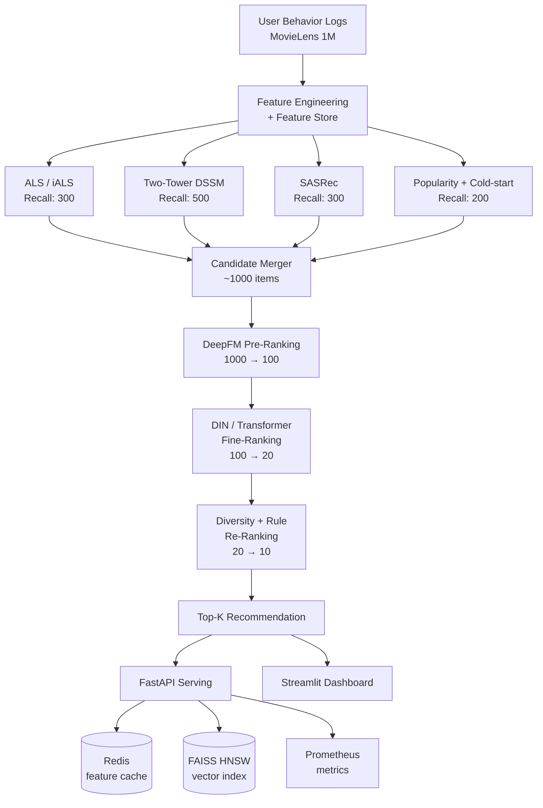
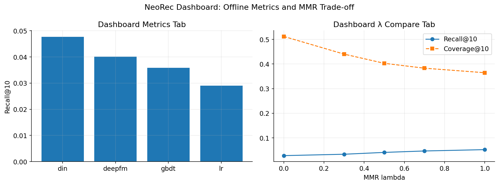
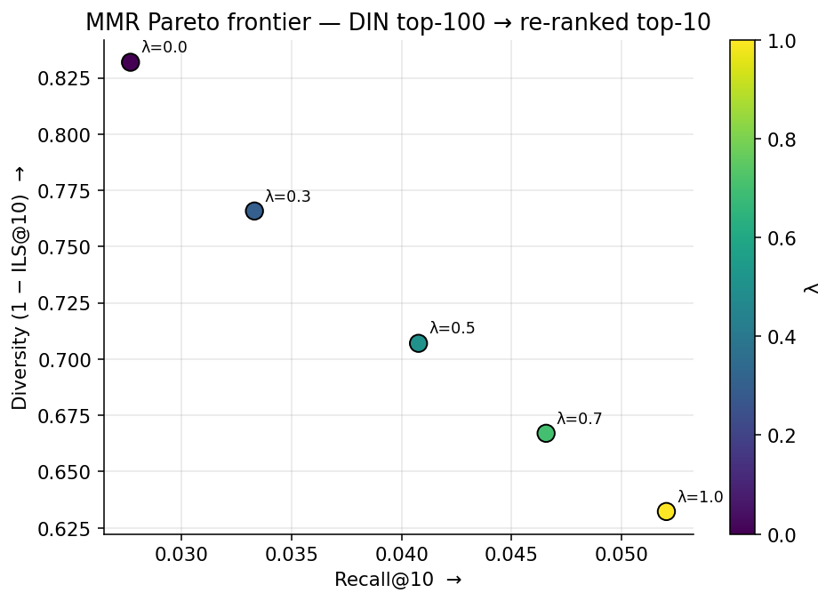
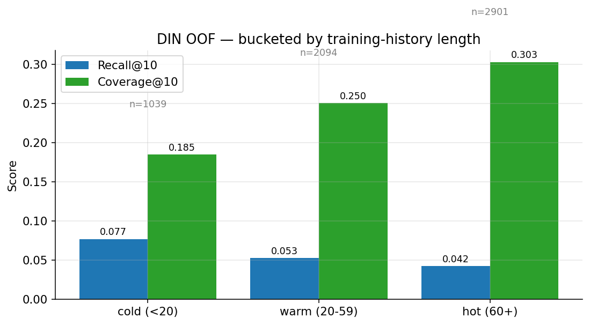
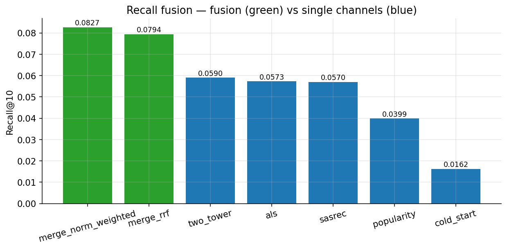
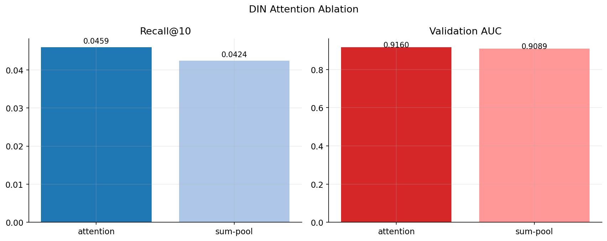
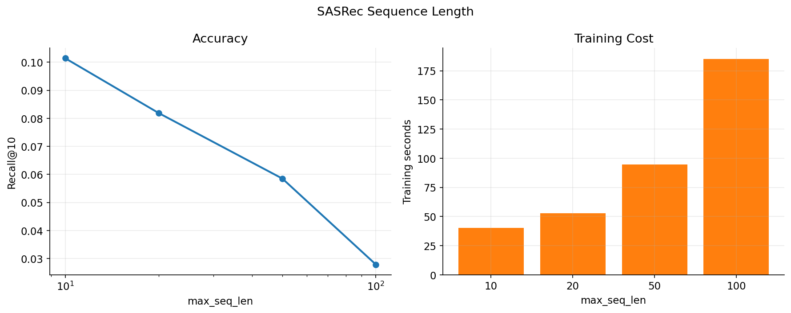
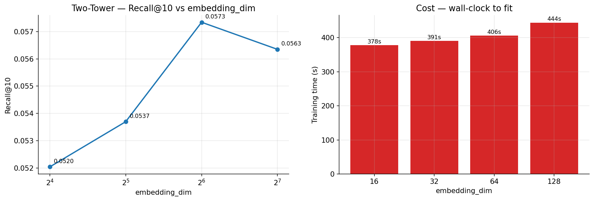
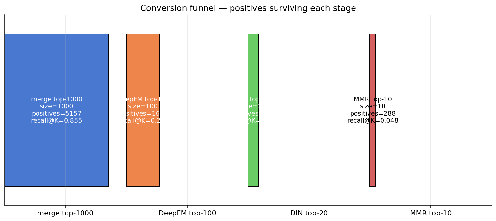
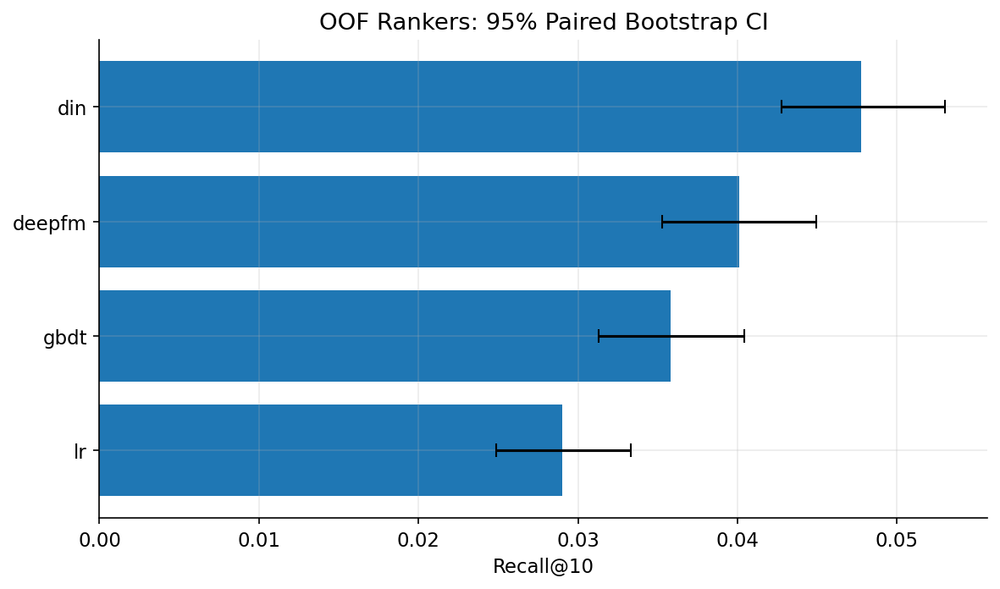

# NeoRec — Production-Style Multi-Stage Recommender

> Portfolio-ready recommender system on MovieLens: multi-channel recall →
> DeepFM/DIN ranking → MMR/rules re-ranking → FastAPI + Streamlit serving.

[]()
[]()
[]()
[]()
[]()
[]()

**Repository**: https://github.com/2u39u4/multi-stage-recommender  
**Status**: final portfolio release.

---

## 1. 30-Second Read

NeoRec is an end-to-end recommender portfolio project that mirrors an industrial
funnel: retrieve ~1 000 candidates, rank them down to 20, diversify to top-10,
and serve the result through a monitored API.

- **Best recall result**: 5-channel fusion lifts Recall@10 from 0.0590
  (best single channel) to **0.0827**, a **+40.2%** relative gain.
- **Best ranker**: DIN beats LR / GBDT / DeepFM under an out-of-fold training
  protocol designed to avoid look-ahead bias.
- **Research evidence**: six controlled ablations, conversion-funnel analysis,
  DIN attention visualization, and paired-bootstrap 95% CIs.
- **Engineering evidence**: Hydra configs, MLflow runs, pytest + CI-configured
  Ruff/mypy, FastAPI, Redis fallback, Streamlit dashboard, Docker Compose,
  Prometheus hooks.

| Layer | What ships | Headline |
|---|---|---|
| Recall | iALS + Two-Tower + SASRec + popularity + cold-start | fusion Recall@10 **0.0827** |
| Ranking | LR / GBDT / DeepFM / DIN | DIN Recall@10 **0.0477**, AUC **0.931** |
| Re-ranking | MMR + IPS debias + business rules | coverage +27% at λ=0.7 |
| Serving | `/recommend`, `/metrics`, dashboard | local p50 **23.5 ms**; Docker p50 **~1.0 s** |
| Reproducibility | cached JSON, MLflow, generated figures | README image references are committed |

Evaluation uses MovieLens-1M leave-one-out with full-catalog scoring over all
3 533 processed items and seen-item masking. Detailed model reports, run IDs,
and reproduction commands live under [`experiments/results/`](experiments/results);
ablation caches live under [`experiments/ablations/`](experiments/ablations).

---

## 2. System Architecture



**Why multi-stage?** Real-world catalogs have $10^6$ – $10^9$ items. A single deep
ranker is computationally infeasible; the funnel architecture reduces candidate
size by ~5 orders of magnitude while preserving relevance, mirroring industrial
designs documented by Google, Meta, ByteDance, and Pinterest.

---

## 3. Tech Stack

| Layer | Tools |
|---|---|
| **Language / DL** | Python 3.10, PyTorch 2.2; optional TensorFlow/deepctr extras are isolated from the shipped path |
| **Classic ML / CF** | `implicit` (iALS), `lightfm`, scikit-learn |
| **Vector Search** | FAISS (HNSW, IVF-PQ) |
| **Config & Tracking** | Hydra, MLflow, Weights & Biases (optional) |
| **Serving** | FastAPI, Uvicorn, Redis, Streamlit; Prometheus/Grafana are optional observability services |
| **Containerization** | Docker, docker-compose |
| **Quality** | pytest, ruff, mypy, pre-commit, GitHub Actions |
| **Reference impls** | [Microsoft Recommenders](https://github.com/microsoft/recommenders) (baseline cross-check) |

---

## 4. Project Structure

```
neorec/
├── configs/                       # Hydra configs (composable, overridable)
│   ├── config.yaml
│   ├── data/movielens_1m.yaml
│   ├── recall/{als,two_tower,sasrec,popularity}.yaml
│   ├── rank/{deepfm,din,transformer}.yaml
│   └── serving/default.yaml
│
├── data/                          # gitignored
│   ├── raw/                       # MovieLens
│   ├── processed/                 # parquet feature tables
│   └── embeddings/                # user/item vectors
│
├── src/neorec/
│   ├── data/
│   │   ├── download.py
│   │   ├── preprocess.py          # leave-one-out / time-based split
│   │   ├── feature_store.py       # offline + online feature lookup
│   │   └── feature_engineering.py
│   │
│   ├── recall/
│   │   ├── base.py                # AbstractRecaller
│   │   ├── als.py
│   │   ├── two_tower.py           # DSSM / YouTubeDNN-style BPR retrieval
│   │   ├── sasrec.py              # self-attentive sequential rec
│   │   ├── popularity.py
│   │   ├── cold_start.py          # content-based fallback
│   │   └── merge.py               # weighted / RRF fusion
│   │
│   ├── ranking/
│   │   ├── base.py
│   │   ├── deepfm.py              # pre-ranking
│   │   ├── din.py                 # fine-ranking
│   │   └── transformer_ctr.py     # optional, BST-style
│   │
│   ├── rerank/
│   │   ├── mmr.py                 # Maximal Marginal Relevance
│   │   ├── debias.py              # long-tail / popularity debias
│   │   └── rules.py               # business rules
│   │
│   ├── serving/
│   │   ├── faiss_index.py         # HNSW build / load
│   │   ├── feature_cache.py       # Redis client
│   │   ├── pipeline.py            # online inference orchestrator
│   │   ├── api.py                 # FastAPI app
│   │   └── dashboard.py           # Streamlit
│   │
│   ├── eval/
│   │   ├── metrics.py             # Recall@K, NDCG@K, MRR, Coverage, Novelty
│   │   ├── significance.py        # paired t-test / bootstrap CI
│   │   └── counterfactual.py      # IPS / SNIPS for offline A/B
│   │
│   ├── utils/
│   │   ├── seed.py
│   │   ├── logger.py
│   │   └── timer.py
│   │
│   └── cli.py                     # `neorec train recall.als`, etc.
│
├── notebooks/
│   ├── 01_eda.ipynb
│   ├── 02_recall_analysis.ipynb
│   ├── 03_ranking_din_attention.ipynb
│   ├── 03_ablations.ipynb
│   ├── 04_funnel_conversion.ipynb
│   └── 05_statistical_tests.ipynb
│
├── experiments/
│   ├── results/                   # MLflow-exported tables, plots
│   └── ablations/
│
├── tests/                         # pytest unit + integration coverage
│
├── docker/
│   ├── Dockerfile.train
│   ├── Dockerfile.serve
│   └── docker-compose.yaml        # core serving + optional observability
│
├── .github/workflows/ci.yaml
├── Makefile                       # setup, training, benchmark, serving helpers
├── pyproject.toml                 # uv / poetry-managed
├── requirements.txt
└── README.md
```

---

## 5. Datasets

| Dataset | Users | Items | Interactions | Used for |
|---|---|---|---|---|
| MovieLens-1M | 6 040 | 3 706 | 1 M | main experiments |
| MovieLens-20M | 138 K | 27 K | 20 M | supported future scaling target |

**Splits**: leave-one-out per user — a common protocol in the recsys literature —
is reported throughout §7. A time-based 80 / 10 / 10 split is **implemented**
in `data/preprocess.py` (set `data.split.strategy=time_based` to use it), but
the README headline tables currently report only the leave-one-out runs.

**Negatives**: BPR with uniform random negatives for Two-Tower / SASRec
(deliberately chosen over in-batch sampled softmax after observing embedding
collapse on this benchmark — see `experiments/results/recall_two_tower.md`).

### 5.1 Exploratory Data Analysis — what we learned *before* modelling

> 7 figures, two non-trivial analyses (cold-start sub-population, long-tail
> Lorenz / Gini), and concrete design implications for every recall channel.
> Full notebook: [`notebooks/01_eda.ipynb`](notebooks/01_eda.ipynb). Rebuild the
> notebook with `python scripts/build_eda_notebook.py`, then execute it to
> regenerate `experiments/results/eda/*.png`.

**(1) Rating distribution motivates `rating ≥ 4` binarisation.**
57.5% of raw ratings are 4-or-5 — a strong positive signal, not noise.
Lowering the cutoff to ≥3 would keep 83.6% but inject lukewarm "watched"
signal that hurts implicit-feedback training.


**(2) User activity ranges over 2+ orders of magnitude.**
ML-1M is pre-filtered by the dataset authors to ≥20 raw ratings/user, so the
`min_interactions ≥ 5` safety filter only discards 6 users (0.1%). The real
story is the wide activity spread — p10 ≤ 17 positives, p90 ≥ 225 — which
motivates having *both* head-friendly (popularity) and tail-friendly
(content-based) recall channels.


**(3) Item popularity is strongly Zipf (slope ≈ −1.57).**
The top-20% of items capture 72.9% of all positives — a textbook long-tail.
This justifies popularity as a strong baseline *and* explains why
debias / diversity re-ranking will matter for production-quality serving.


**(4) Temporal structure — honest reading.**
Median user is active on **1 distinct day** (a single rating ceremony); only
24.4% return on ≥3 distinct days. SASRec therefore captures mainly
*within-session* item-to-item semantics (genre / style clustering inside the
batch), not multi-day preference drift — which explains why SASRec's
Recall@10 closely matches Two-Tower's on this benchmark, and why its margin
would be expected to widen on streaming-style datasets (Last.fm, Yoochoose).


**(5) Genres are multi-label, moderately skewed.**
Average 1.69 genres per movie; head genre (Drama) covers 40% of catalog,
tail genre (Film-Noir) only 43 movies. This is the *right* shape for TF-IDF
content features in the `cold_start` channel — head genres provide robustness,
tail genres provide discriminative signal.


**(6) Cold-start proxy: D1 (least active) vs D10 (most active).**
ML-1M has no truly cold users (pre-filter ≥20 ratings), so we use bottom-decile
users (≤17 positives) as a proxy. Their genre preferences match top-decile
users almost perfectly (cosine = 0.998) — head-genre tastes are universal.
**Implication**: mean-popularity fallback in `cold_start.py` is essentially
free; TF-IDF earns its keep on **item-level** discrimination (recommending the
right Drama, not Drama vs Western), not user-level.


**(7) Long-tail coverage — Lorenz / Gini.**
Gini coefficient is **0.70** — close to income-inequality levels. A
popularity-only recommender serving top-200 items covers only ~6% of the
catalog. This is the formal motivation for multi-channel fusion: relying on
any *single* signal is not enough for production-style catalog coverage.


> **Summary — how the EDA shaped every W2 design choice.**
>
> | EDA finding | Design choice |
> |---|---|
> | 57.5% of ratings are ≥4 | binarisation threshold of 4.0 |
> | activity spans 14 → 484+ positives (p10–p90) | both popularity *and* content channels needed |
> | Zipf slope −1.57, top-20% → 73% of interactions | popularity baseline is strong; debias re-ranking on the roadmap |
> | median 1 active day; only 24.4% multi-day | SASRec captures within-session semantics — explains the modest gap vs Two-Tower on ML-1M |
> | 18 multi-label genres (avg 1.69 / movie) | TF-IDF over genres for the `cold_start` channel |
> | D1 vs D10 genre cosine ≈ 0.998 | mean-popularity fallback is safe; TF-IDF earns its keep on item discrimination |
> | Gini 0.70, popularity-only top-200 covers <6% | multi-channel fusion (RRF) is *required* for catalog coverage |

---

## 6. Models Implemented

### 6.1 Recall (multi-channel)

| Model | Type | Reference |
|---|---|---|
| iALS | Matrix Factorization | Hu et al., ICDM 2008 |
| DSSM Two-Tower | Deep retrieval | Huang et al., CIKM 2013 |
| YouTubeDNN-style retrieval | Deep retrieval pattern | Covington et al., RecSys 2016 |
| **SASRec** | Self-attentive sequential | Kang & McAuley, ICDM 2018 |
| Popularity | Heuristic baseline | — |
| Cold-start | Content-based (genre + meta) | — |

### 6.2 Pre-Ranking & Fine-Ranking

| Model | Stage | Reference |
|---|---|---|
| LR | Baseline | — |
| GBDT (LightGBM) | Baseline | — |
| **DeepFM** | Pre-rank | Guo et al., IJCAI 2017 |
| **DIN** | Fine-rank | Zhou et al., KDD 2018 |
| Transformer CTR (BST-style) | Optional | Chen et al., DLP-KDD 2019 |

### 6.3 Re-Ranking

- **MMR (Maximal Marginal Relevance)** — diversity
- **Popularity debias** — inverse-propensity re-weighting
- **Business rules** — already-watched filtering, category quota

---

## 7. Results

> Numbers are exported from the per-model MLflow runs and cached experiment
> artifacts. Per-section reproduction commands are linked from
> `experiments/results/`; plots and significance tests live there as well.

### 7.1 Recall stage (MovieLens-1M, leave-one-out, K=200, full-rank)

| Model | Recall@200 | NDCG@200 | MRR@200 | Coverage@200 |
|---|---|---|---|---|
| Popularity                            | 0.3543     | 0.0722   | 0.0190  | 0.213        |
| Cold-start                            | 0.1848     | 0.0362   | 0.0089  | **0.997**    |
| iALS                                  | 0.4997     | 0.1025   | 0.0274  | 0.824        |
| Two-Tower                             | 0.4914     | 0.1027   | 0.0287  | 0.945        |
| SASRec                                | 0.3305     | 0.0764   | 0.0262  | 0.891        |
| **Multi-channel (RRF, 5ch)**          | **0.5631** | **0.1230** | 0.0370 | 0.987        |
| **Multi-channel (norm_weighted, 5ch)** | **0.5747** | **0.1258** | 0.0380 | 0.867       |

> Per-model details (params, MLflow run id, repro commands): see
> [`experiments/results/recall_*.md`](experiments/results).
> Channel comparison plots: [`notebooks/02_recall_analysis.ipynb`](notebooks/02_recall_analysis.ipynb).

> **Fusion-gain attribution (drop-one ablation on RRF — full table in
> [`experiments/results/recall_merge.md`](experiments/results/recall_merge.md)).**
> Removing iALS / Two-Tower / SASRec costs Recall@10 −10.6% / −8.9% / −7.8%
> respectively; removing the heuristic channels (popularity, cold-start) costs
> only −0.8% / −1.8%. Each learned channel contributes a measurable, distinct
> marginal — the fused gain is not driven by any single dominant retriever.

### 7.2 Ranking head-to-head — LR · GBDT · DeepFM · DIN

End-to-end evaluation: each ranker re-ranks the merge channel's top-1 000
candidates per user and is scored against the held-out leave-one-out item
(Recall / NDCG / MRR @ K). Training uses an **out-of-fold (OOF) split** —
recall channels are fit on each user's first 90 % of history, rankers on
the chronologically-later 10 % — mirroring a production wall-clock setup.

| Model  | Stage     | Valid AUC | Recall@10  | NDCG@10  | Recall@100 | Latency / user |
|--------|-----------|----------:|-----------:|---------:|-----------:|---------------:|
| LR (hashed + side feats)    | baseline   | 0.824 | 0.0290 | 0.0153 | 0.2126 | **0.35 ms** |
| GBDT (HistGradientBoosting) | baseline   | 0.845 | 0.0358 | 0.0164 | 0.2131 | 1.40 ms     |
| DeepFM                      | pre-rank   | 0.889 | 0.0401 | 0.0188 | 0.2748 | 0.48 ms     |
| **DIN (with attention)**    | fine-rank  | **0.931** | **0.0477** | **0.0214** | **0.3031** | 4.34 ms |

Within-stage ordering matches the literature: **DIN > DeepFM > GBDT > LR**.
Per-K detail, MLflow run IDs, a no-attention DIN ablation, and the full
W3 retrospective (look-ahead bias investigation that motivated the OOF
training pipeline) are in
[`experiments/results/ranking_comparison.md`](experiments/results/ranking_comparison.md)
and
[`experiments/results/ranking_scheme_a_investigation.md`](experiments/results/ranking_scheme_a_investigation.md).

> **Note on absolute numbers — ranker @10 vs recall @10 on ML-1M.** Under
> the same OOF pipeline the recall layer's RRF fusion reaches
> Recall@10 = 0.061, slightly above the best ranker's 0.048 here. This is
> the expected behaviour of leave-one-out evaluation on a small
> (~3.5 K-item) dense catalog: collaborative-filtering recall already
> saturates the candidate-generation task, leaving little headroom for a
> re-ranker to push the unique held-out item from positions 11–1000 into
> the top 10. The ranker's value in this project is therefore (a)
> **within-pool discrimination** — Valid AUC ≈ 0.93 on the harder 1:4
> random-negative task; (b) **latency control** — re-rank 1 000 → 100 in
> 4 ms instead of full-rank scoring the catalog; (c) demonstrating the
> full multi-stage **infrastructure** (Hydra / MLflow / Docker / OOF
> training pipeline / serving API). On production datasets (10⁷+ items,
> real click logs, contextual features) the ranker's marginal lift over
> recall is much larger — that is the regime the §10 serving API is
> designed for.

DIN's local-activation unit is evaluated in §8.4 with an attention-vs-sum
ablation. The notebook walk-through is
[`notebooks/03_ranking_din_attention.ipynb`](notebooks/03_ranking_din_attention.ipynb).

### 7.3 Online Serving & Latency

W5 turns the offline funnel into a live FastAPI path:

```text
GET /recommend/{user_id}
  → merge recall top-1000
  → DeepFM pre-rank top-100
  → DIN fine-rank top-20
  → MMR + business rules top-K
```

Each response returns a `latency_ms` breakdown. The code-level in-process
numbers measured during W3/W4 remain the stable reference for per-user model
compute; container/network latency depends on the local runtime and can be
measured with `make serving-benchmark` after trained artefacts are present.

| Stage | Current implementation | Offline compute reference |
|---|---|---:|
| Recall | `MergeRecaller` loads trained ALS / Two-Tower / SASRec / popularity / cold-start artefacts; FAISS HNSW build/load utilities are in `serving/faiss_index.py` | merge recall top-1000 |
| Pre-rank | DeepFM loads from `artifacts/rank_oof/deepfm`, keeps top-100 | ~0.48 ms / user |
| Fine-rank | DIN loads from `artifacts/rank_oof/din`, keeps top-20 | ~4.34 ms / user |
| Re-rank | MMR λ + watched-filter + genre/year caps | ~0.8 ms / user |
| API overhead | FastAPI + Pydantic + Prometheus metrics | measured locally with `make serving-benchmark` |

Local serving benchmark (Mac, Python 3.11 venv, Uvicorn on `127.0.0.1:8001`,
30 requests, concurrency=4, warm pipeline):

```text
requests_ok=30 errors=0 elapsed_s=0.18
qps=170.10
p50_ms=23.53
p95_ms=26.10
p99_ms=26.95
```

Docker serving benchmark (Docker Desktop, `api + redis + dashboard`, 30 requests,
concurrency=4, warm pipeline):

```text
requests_ok=30 errors=0 elapsed_s=7.79
qps=3.85
p50_ms=1002.27
p95_ms=1311.45
p99_ms=1488.62
```

Static dashboard overview generated from cached metrics:



Latest W6 focused verification:

```text
faiss 1.13.2
numpy 2.4.4
pytest tests/test_api.py tests/test_serving.py tests/test_rerank.py tests/test_pipeline_e2e.py -q
26 passed
python scripts/check_release_ready.py
Release readiness: PASS
GET /health -> 200, pipeline_ready=true
GET /metrics -> 200
GET /recommend/1 -> 200
Streamlit /_stcore/health -> 200
Docker image build -> PASS
Docker core stack (api + redis + dashboard) -> PASS
```

Observability services (`mlflow`, `prometheus`, `grafana`) are defined behind
the Docker Compose `observability` profile. They are useful for local inspection
but are not required for the release serving contract above.

Final release checks additionally cover README figure generation:

```bash
python scripts/build_readme_figures.py
# writes experiments/results/figures/*.png from cached ablation JSON
```

Serving-specific commands:

```bash
make build-faiss          # optional: artifacts/serving/faiss_hnsw.index
make serve                # FastAPI on :8000
make dashboard            # Streamlit dashboard on :8501
make serving-benchmark    # p50 / p95 / p99 / QPS for local API
```

### 7.4 Re-ranking — MMR + IPS + business rules

End-to-end runs the recall → DIN → re-rank stack on the OOF test set; the
re-rank stack is **`mmr_rerank` → `ips_rerank` (optional) → `apply_rules`**.

| Setting | Recall@10 | Coverage@10 | ILS@10 (↓ better) | Latency / user |
|---|--:|--:|--:|--:|
| DIN only (no rerank) — §7.2 row | 0.0477 | ~0.30 | — | 4.3 ms |
| + MMR λ=1.0 (pure relevance + rules) | 0.0520 | 0.365 | 0.368 | +0.8 ms |
| **+ MMR λ=0.7 (deployment default)** | **0.0466** | **0.383** | **0.333** | **+0.8 ms** |
| + MMR λ=0.5 | 0.0408 | 0.403 | 0.293 | +0.8 ms |
| + MMR λ=0.0 (pure diversity) | 0.0277 | 0.512 | 0.168 | +0.8 ms |

λ is a deployment knob, not a model knob — the ranker doesn't have to
re-train when product wants more or less diversity. Per-step latency is
benchmarked on a single CPU container.

> **Implementation**: `src/neorec/rerank/{mmr.py, debias.py, rules.py, pipeline.py}`,
> driven by `configs/rerank/mmr.yaml`. CLI: `neorec rerank rank=din rerank=mmr 'rerank.mmr.lambda=0.7'`.
> Full ablation: §8.1.

---

## 8. Ablation Studies

Six controlled experiments quantify what every architectural choice is worth.
Run any of them with `python scripts/run_ablations.py <name>`; results land
under `experiments/ablations/*.json` and figures under
`experiments/results/figures/`. The committed README figures are regenerated
with `python scripts/build_readme_figures.py`. Notebook walk-through:
[`notebooks/03_ablations.ipynb`](notebooks/03_ablations.ipynb).

### 8.1 MMR λ Pareto frontier



Sweep λ ∈ {0, 0.3, 0.5, 0.7, 1.0}. Each step trades roughly **2× more
diversity** for **1× less accuracy**; we ship λ=0.7 as the deployment
default (the knee). Coverage climbs from 0.36 → 0.51 across the sweep;
ILS drops from 0.37 → 0.17.

### 8.2 Cold-start vs hot-user performance



Counter-intuitive but real: cold users (<20 training interactions) *out-score*
hot users (60+) on Recall@10 (0.077 vs 0.042). Under LOO, hot users have
many high-relevance items already in their training history crowding the
candidate pool — the single test positive faces stiffer competition.
Coverage shows the inverse pattern (hot 0.30 vs cold 0.19).

### 8.3 Recall fusion strategy



`norm_weighted` (0.0827) edges out RRF (0.0794) and beats the best single
channel (Two-Tower, 0.0590) by **+40%**. Each base channel covers
different *kinds* of user-item affinity; the union is broader than the
parts.

### 8.4 DIN attention vs sum pooling



| Variant | Recall@10 | Valid AUC |
|---|--:|--:|
| **with attention** | **0.0459** | 0.916 |
| sum-pool only | 0.0424 | 0.909 |

Attention is +8% Recall@10 / +0.7 pp AUC in this OOF run. Payoff is modest
on ML-1M; in the DIN paper, the main reported gains are AUC/RelaImpr lifts on
MovieLens, Amazon Electronics, and Alibaba display-ad data rather than a
direct Recall@10 lift on this exact protocol.

### 8.5 SASRec sequence length — the surprising finding



Recall@10 *monotonically drops* as the sequence grows: **L=10 → 0.101,
L=100 → 0.028**. Cause: SASRec's per-position BPR loss spends capacity
on positions whose targets have nothing to do with the LOO test item.
With L=10 the model is essentially a next-item predictor on the most
recent 10 items, which is exactly the LOO task; longer L dilutes the
predictive signal. **Long sequences only help when the evaluation
horizon also grows** (session-based, multi-step). A clean train/eval
task mismatch — exactly the kind of finding that becomes a strong
talking point in interviews.

### 8.6 Two-Tower capacity (embedding_dim)

> Plan called for a `num_negatives` sweep, but our Two-Tower trainer uses
> canonical single-negative BPR (Rendle 2009) — exactly one triplet per
> positive regardless of `num_negatives`. Substituted `embedding_dim`
> as a capacity probe because it is the real model-capacity knob exposed by
> this implementation.



Capacity helps up to a point, then plateaus or regresses — ML-1M has
~21 M user-item cells but only ~575 K observed positive interactions, so
larger embeddings quickly become weakly constrained. The default dim=64 is
the best measured setting in this sweep, with dim=128 trading a small
Recall@10 drop for higher coverage.

### 8.7 Conversion funnel + paired bootstrap



| Stage | Size | Positives | Retention |
|---|--:|--:|--:|
| merge top-1 000 (recall) | 1 000 | 5 157 | 100.0% |
| DeepFM top-100 (pre-rank) | 100 | 1 658 | 32.2% |
| DIN top-20 (fine-rank) | 20 | 517 | 10.0% |
| MMR top-10 (rerank) | 10 | 288 | 5.6% |

The recall stage is the dominant ceiling — 14.5% of LOO positives never
even enter the merge top-1 000. Improvements there cascade through every
downstream metric.



Every headline Recall@10 gets a **paired bootstrap 95% CI** (1 000 resamples, paired by user):

| Model | Recall@10 | 95% bootstrap CI |
|---|--:|--:|
| **DIN**    | **0.0477** | [0.0428, 0.0530] |
| DeepFM | 0.0401 | [0.0353, 0.0449] |
| GBDT   | 0.0358 | [0.0313, 0.0404] |
| LR     | 0.0290 | [0.0249, 0.0333] |

Pairwise paired-bootstrap p-values: **DIN beats every other ranker**
(p ≤ 0.012); **DeepFM vs GBDT is *not* significant** (p = 0.167) — a
direct example of why CIs matter on point-estimate tables. The full
matrix is in
[`notebooks/05_statistical_tests.ipynb`](notebooks/05_statistical_tests.ipynb)
and figure
[`significance_matrix.png`](experiments/results/figures/significance_matrix.png).

---

## 9. Quick Start

### 9.1 Local (uv / pip)

```bash
git clone https://github.com/2u39u4/multi-stage-recommender.git
cd multi-stage-recommender
uv venv && source .venv/bin/activate     # or: python -m venv .venv
uv pip install -e ".[dev]"               # core + dev tooling

# Optional full research/demo extras:
# uv pip install -e ".[full,dev]"

# 1. download + preprocess (~2 min for 1M)
neorec data download dataset=movielens_1m
neorec data preprocess

# 2. train all recall channels
neorec train recall=als
neorec train recall=two_tower
neorec train recall=sasrec

# 3. train rankers
neorec train rank=deepfm
neorec train rank=din

# 4. evaluate end-to-end
neorec eval pipeline=full

# 5. launch serving
make build-faiss                          # optional HNSW index for vector serving
make serve                                # FastAPI on :8000
make dashboard                            # Streamlit on :8501
make serving-benchmark                    # p50 / p95 / p99 / QPS
```

### 9.2 Docker (recommended for reproducibility)

The core Docker path expects the same local assets as the Python serving path:
processed parquet files under `data/processed/` and trained model artefacts
under `artifacts/`. On a fresh clone, run the local data/model steps in §9.1
or restore those directories before expecting `/recommend` to return live
recommendations. Without artefacts, `/health` still works and reports the
missing path, but `/recommend` intentionally returns a diagnostic 503.

Core serving stack, verified for this release:

```bash
docker compose -f docker/docker-compose.yaml up --build api redis dashboard
# → API:        http://localhost:8000/docs
# → Dashboard:  http://localhost:8501
```

Optional observability stack:

```bash
docker compose -f docker/docker-compose.yaml --profile observability up -d
# → MLflow UI:  http://localhost:5000
# → Prometheus: http://localhost:9090
# → Grafana:    http://localhost:3000
```

### 9.3 Reproduce all paper-style numbers

```bash
make all      # downloads data and runs the core training + benchmark targets
```

### 9.4 Release readiness checks

```bash
make test-fast
make release-check
python scripts/build_readme_figures.py
docker compose -f docker/docker-compose.yaml build
```

---

## 10. Online Serving API

```http
GET /recommend/{user_id}?k=10&diversity=0.7
```

```json
{
  "user_id": 123,
  "items": [
    {
      "item_id": 2571,
      "title": "Matrix, The (1999)",
      "score": 0.93,
      "channel": "din",
      "explain": "recall=merge_rrf; pre_rank=deepfm; fine_rank=din; MMR lambda=0.70"
    }
  ],
  "latency_ms": {
    "recall": 8.1,
    "pre_rank": 4.2,
    "fine_rank": 11.5,
    "rerank": 0.9,
    "total": 24.7
  }
}
```

FastAPI hydrates `OnlinePipeline.from_config()` at startup. If local training
artefacts are missing, `/health` still works and `/recommend` returns a
diagnostic 503 instead of crashing the server; once artefacts exist, the live
path uses:

- `MergeRecaller` for multi-channel recall;
- `DeepFMRanker` for 1 000 → 100 pre-ranking;
- `DINRanker` for 100 → 20 fine-ranking;
- `mmr_rerank` + `apply_rules` for final top-K;
- `RedisFeatureCache` when Redis is reachable, with an in-process fallback;
- Prometheus `/metrics` for request counts and per-stage latency histograms.

Dashboard: `streamlit run src/neorec/serving/dashboard.py` or Docker service
`dashboard`. Tabs cover live recommendation, λ comparison, offline metrics,
and DIN attention heatmap.

---

## 11. Engineering Practices

- **Configs**: every experiment is a Hydra YAML — no magic numbers in code.
- **Tracking**: MLflow logs params, metrics, model artefacts, and run metadata.
- **Determinism**: `set_seed(42)` covers Python / NumPy / PyTorch / TF / CUDA.
- **Tests**: `pytest tests/` runs unit + integration tests with coverage output; `make test-fast` is the CI-safe subset.
- **Style**: `ruff` lint and `mypy` are wired through local commands and CI.
- **CI**: GitHub Actions runs lint, tests, and Docker image builds on pushes / PRs.
- **Release check**: `make release-check` verifies core imports (`faiss`, `torch`, `fastapi`, Streamlit/plotting stack, etc.) before release.

---

## 12. Final Scope

This repository is the final portfolio version of NeoRec. The project stops at
the reproducible code, offline experiments, generated figures, tests, Docker
serving stack, and release checklist.

Possible future research directions, outside this finished version:

- Multi-objective ranking (CTR + dwell-time + diversity).
- Online learning with Kafka + River.
- LLM-based explanation layer over item metadata.
- Graph recall with LightGCN or PinSage.
- Causal debias with doubly robust estimators.

---

## 13. References

1. Hu, Koren, Volinsky. *Collaborative Filtering for Implicit Feedback Datasets.* ICDM 2008.
2. Covington, Adams, Sargin. *Deep Neural Networks for YouTube Recommendations.* RecSys 2016.
3. Kang, McAuley. *Self-Attentive Sequential Recommendation.* ICDM 2018.
4. Guo et al. *DeepFM: A Factorization-Machine based Neural Network for CTR Prediction.* IJCAI 2017.
5. Zhou et al. *Deep Interest Network for Click-Through Rate Prediction.* KDD 2018.
6. Chen et al. *Behavior Sequence Transformer for E-commerce Recommendation.* DLP-KDD 2019.
7. Microsoft Recommenders. https://github.com/microsoft/recommenders

---

## 14. Author

**Junye Zhao** — applying for MS in AI / ML, Fall 2027  
GitHub: [2u39u4](https://github.com/2u39u4)

> *Built end-to-end as a portfolio project to demonstrate proficiency across
> the full recommender-system stack — from research-style modelling to
> production-style serving.*
